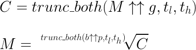

# LITE
Limited Information Tetration Encryption  
Made with Darcy ([@Ivelieu](https://github.com/ivelieu/)) and Ben ([@PuZZleDucK](https://github.com/PuZZleDucK)) at the [Internet Freedom Hack from 20/04/2018 to 22/04/2018](https://digitalrightswatch.org.au/2018/03/22/internet-freedom-hack-defending-truth/).  
Darcy: I made the C file using JetBrains CLion.  

This information is live [here](https://ivelieu.github.io/LITE/).

## The General Formula



Where C is the ciphertext, M is the plaintext message  
b is the base exponent, p is the primitive exponent  
Ideally, b and p are coprime, but I do not believe this is required.
g is the generator slice = b^^p  
t<sub>l</sub> and t<sub>h</sub> are the truncations of the message encryption computation (which are determined by the receiver, who generates the private keys. The truncation of the requested message is different to the truncation of g. The truncation of g is only known by the receiver, similarly to the private keys b and p.)  
Private keys: [b, p]  
Public keys: [g, t<sub>l</sub>, t<sub>h</sub>]

## Transmission process example

Public key 1: 553 truncated from 65536  
Let us call this public key g, for generator of the ciphertext.  
other names: public slice, public fraction?  

Public key 2: t<sub>h</sub> = 2, t<sub>l</sub> = 4  
ie. trunc_both(65536, 2, 4) returns 553.
Let us call public key to t<sub>l</sub> and t<sub>h</sub>: t<sub>l</sub> is the lower bound of truncation, t<sub>h</sub> is the higher bound.  
There is a minimum required truncation definition!  

The lower bound is defined by the length of the private key's tetration operation. ie. Since 2^^4 has less than 60 digits, our example in practice would require larger private keys. ie. I do not believe cycling the non-truncated private key would be satisfactory.  

The upper bound is only defined by the geometry of the universe. So, one can utilise 100% of a channel to transmit a message of unknown length or values. This truly reveals no information about either the encrypted text or the private keys. Hooray for perfect forward secrecy!  

Private keys: 2 and 4  
ie. 2 is the base and 4 is the primitive exponent  
(it gets more complex as the result is calculated. 2^^4 = 2^2^2^2 = 2 * 2 ...)  
Let us call the private keys b and p.  
The private key in total is the result b^^p. For this private calculated key (b^^p) to be secure by the metod of the LIP (Limited Information Problem), the number of digits of (b^^p) must be greater than the number of atoms in the observable universe. ie. 10^80.  
<sub>Note, I was told 10^80 represents the number of particles in the observable universe, not atoms. This is not really an important distinction to make given how much past this magnitude I am going.</sub>  
I'm bob, I did that, I send 553 as public key to Alice  
Alice exponents their message by 553.  
The message is 42, obviously.  
`42 = (42^553)` rooted to the exponent of `(42^553) `  
`= 4.53 * 10^897` -- almost a googleplex!  
They send a subset to me, over an untrusted channel. I tell them which subset I want.   
(both public keys are sent simultaneously)  
They don't know the subset of public key 1.  
I get the result. I perform (the message) rooted to the exponent of (2^^4 truncated to public key 2) inside my quantum computer.  


#### The quantum computer spits out 42. 
I'll admit, I am not up to sketch on writing Q# to do this.  
This is a todo for me if this project furthers development.
## About truncation on both ends of a number
Until now, truncation has only needed to be in one direction. ie. "round to 2 decimal places" is truncating the lower bound. "up to 6 significant figures" is also the lower bound. Truncation to the upper bound has no universal mathematical function.  
Let there be a function `trunc_up` that accepts one number for the value to be truncated, and another value for the upper truncation bound. The function `trunc_up(x,n)` returns the first n traveling along x from the reverse big endian path, ignoring zeroes on the end.  

Let there be a function `trunc_both` that accepts one number for the value to be truncated, another value for the lower truncation bound, and another value for the upper truncation bound. This function `trunc_both(x,tl,th)` will perform the following psuedocode:  
```
x1 = trunc(x,tl);  
x2 = trunc_up(x1, th);  
return x2;  
```
Reminder: big endian is the standard of decimal notation.  


## About the Limited Information Problem (LIP)
Let us assume that there is a finite (or, if you would rather, "limited") amount of information in the observable universe.  

Based on this, there must be a limit to the amount of computation that can be observed in the observable universe. This is because if I have a logic circuit LC with complexity greater than the number of atoms in the observable universe (AITOU), which is possible, the output would be larger than AITOU. ie. The output can never be observably recorded in our universe.  

Using this principle, we can design simple, recursive operations that produce outputs that are greater than AITOU past a certain threshold. All equations beyond this threshold are impossible to reverse entirely, according to general relativity applying to the geometry of the universe. However, subsets of this output are observable.  

If a subset of the output greater than AITOU is sufficiently complex to identify itself, but sufficiently small to "be observable inside" the AITOU, it is possible to verify the output subset as a true subset of the output without being able to "recreate" the output using the output subset. The Limited Information Problem is the principle of the latter: given only the sufficiently large subset of a computation greater than AITOU, the original computation cannot be determined.  


### Potential issues  
Targeted quantum entanglement could "observe" the receiver generating the public key truncation and therefore determine b and p. However, doing this probably requires more energy than contained in the universe, so I'd say this is not a concern.  

Quantum tunneling may be a way to circumvent the geometry of the universe to represent g^^p, which could potentially be of concern. Once again, this would need a ridiculous amount of energy, as this would need much more than just one tunnel if you don't want the operation to take 5 billion years.

### Separate topic: DTube
Censorship is decided by the majority of users, not the majority of money  
No ads, no power from user profiling  
Also shows how much revenue is made (in total) from every video! Very cool.  